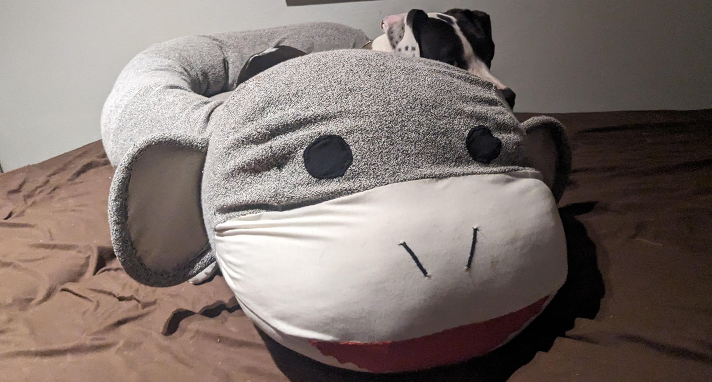

# Animal Donut Dog Bed Tutorial

Or, if that sequence of nouns is too hard to parse: A tutorial for making a bed for dogs which is both donut-shaped and also resembles an animal.

This bed has two zippers so you can take out the three internal cushions and wash the outer shell!

## Materials

  

    
  &#9312; About 3 yards of **lining fabric** - This fabric will be used inside the bed for the three removable cushions that contain all the stuffing.
  
  

  I use whatever inexpensive stretchy fabric I can find.
  
  I think using stretchy fabric here helps achieve the "overstuffed" look for the bed. When the lining fabric stretches, the stuffing is then less constricted by it, and still has a chance to push directly against the outside of the bed.

  I like it when the fabric has a woven-in or knitted-in striped or rectangular pattern, like the fabric I used in this case. It's a super helpful shortcut for measuring and cutting the right shape, since I can just cut along the stripe! Especially when I'm trying to cut out really big rectangular pieces in super stretchy fabric which is really hard to measure consistently as it stretches!
  

  
  **Purchasing tips and ideas**
      

    
  My newest favorite place for finding random cheap fabrics is Walmart's "Value Fabrics" aisle. It's basically an assortment of fabric remnants at different length and price tiers. Depending on the fabrics, you get cuts of 2 yards for $4, 4 yards for $6, and 3 yards for $8. 

  The lining fabric I used for this bed was 4 yards for $6!

  You can order these online, but of course you'll just get a random selection which may or may not be worthwhile. So I prefer to actually go into a Walmart and see what I can find!

  I've also ordered "poly interlock lining fabric" online from both Walmart and Amazon at around $7-$8 for 3 yards. It works well, but it's only stretchy in one direction (also known as 2-way stretch, because of course jargon is more fun when it's counter-intuitive). So you have to be strategic about which direction you cut it in, especially for the donut part (you want it to stretch widthwise, not lengthwise).
  
  

  

  

    
  &#9313; About 3 yards of **fabric for the main bed surface**

  

  You can sometimes get away with 2 yards if you plan really carefully. I actually only had 2 yards of the fabric I used for this bed, and I made it work but I had to do some creative tiling!
  
  I used a slightly-stretchy fabric for this particular dog bed, it's almost like a french terry but with two colors of yarn on the terry side (black and white). 
  
  After that experience, **I highly recommend using a non-stretchy fabric** for this part of the bed. Attaching the long separating zipper was a small nightmare, because the fabric really wanted to stretch out and get all wonky while I was sewing. I ended up applying liberal amounts of basting glue (in addition to the usual pins and fabric clips) before sewing.

  For other similar beds, I've used minky and/or fleece fabric. Actually, a lot of stuffed dog toys "minky swirl fabric" and I found that dogs really like that fabric on a dog bed, too.

  
  **Purchasing tips and ideas**
      

    
  The fabric for this bed actually also came from Walmart's Value Fabric aisle. I think it's really cool fabric, I wish I knew how to find it and buy more of it! But like I mentioned, I probably wouldn't want to make another dog bed out of it because it's a stretchy knit fabric.

  I think non-stretchy "minky" type polyester fabrics are the way to go, dogs seem to love them.

  You can get "Minky swirl/rosette fabric" from Joann and sometimes Michael's. I've bought it from Joanne for another dog bed project and it was quite nice, but I would probably only buy it there when it's on sale. I found [a pretty inexpensive option at Big Z Fabrics](https://bigzfabric.com/collections/minky-rose-rosette-floral-baby-soft-fabric-hug-z-reg) - it seems like the same stuff from their pictures and videos. They also have other interesting "Minky" options to explore.

  Walmart has some pre-cut options they call "Minky Dot Fleece", "Plush Coral Fleece", "Chevron Fleece" and other similar names. I often see specific colors on sale online, but they tend to be full-price in store (though full-price is still pretty reasonable). These usually come pre-cut to 1.5 yards, so you'd have to get two, but that's perfectly workable. Maybe you could even go for two colors and make a colorblocked bed!

  Finally, you can try looking for inexpensive minky/fleece throw blankets and cut them up to use as fabric. I think this is only cost-effective if you shop around aggressively and look for sales, though. For reference, I bought two 60" by 80" cow print blankets for $15 each on Amazon (I'm going to use them to make a cow bed for my cow print puppy!). That's roughly equivalent to 4 yards of fabric, depending on the width of the fabric you'd buy otherwise.

  

    
  &#9314; About 1 yard of **non-slip fabric for bottom of the bed**
  
  

  You can probably also just use the same fabric as you're using for the main bed surface, if you don't need it to be super non-slip and you're not worried about it getting super dirty from the floor.
  
  What you actually need is a piece a little bigger than 36" by 24", so if you buy a yard (which is 36") you may have a lot or a little left over, depending on the width of the fabric.

  I was going to use the orange textured fabric for this at first, because I was out of "real" non-slip fabric. But then I ended up buying the gray non-woven fabric in the second picture and used that.
  

  
  **Purchasing tips and ideas**
      

    
Search for Non-slip and/or Grippy fabric.

It can be kind of expensive, and it's often quite narrow when you buy by the yard - make sure it's at least 24" wide!

Joann has "Cotton Grip Stop Wide Utility Fabric", but again, I would wait for it to be on sale.

I've also found cheaper grippy fabric on Walmart's online store (sold by third-party sellers and apparently shipped from China).

But for this project, I ended up using "Non-slip backing fabric for rugs". You can get it on Amazon for relatively cheap, if you shop around. It's a non-woven fabric and techincally you're not supposed to machine wash it, which would defeat the whole purpose of having removable cushions and a washable outer shell. But so far, it has survived at least one wash/dry cycle!

  

  &#9315; One really long **separating zipper** (around 100-110 inches long)
    
  

 This zipper will go around the bottom of the donut part. It has to be a separating zipper so it can unzip all the way and release the donut cushion.

  

  
  **Purchasing tips and ideas**
      

    
Search for "sleeping bag or tent separating zipper".

The best deal I found is by searching for "2 pcs separating tent zipper" on Walmart's online store. They are sold by a third-party seller (zipperstop). A nice bonus about these particular ones is that the slider is reversible, so I don't have to worry as much about accidentally sewing it on inside-out.

  

  &#9316; One **shorter zipper** - at least 24 inches long, and it doesn't have to be a separating zipper.
    
  

 This zipper will open up a separate compartment for the bottom cushion. It doesn't need to be a separating zipper because there are no donut complications. The zipper just opens up a hole and you take the cushion out through the hole.

  
  **Purchasing tips and ideas**
      

    
You can get **huge** packs of 24-inch zippers on Amazon for pretty cheap. Or at least you used to be able to a while ago. And I've been going through them very slowly ever since that one time I needed a zipper but ended up buying like a 25-pack.

  

  &#9317; At least 5 lbs of **fiber fill** (stuffing)
    
  

You can probably fit a lot more than 5 lbs of stuffing into these cushions, but 5 should be mostly enough. I think I used a little more for this particular bed.

  
  **Purchasing tips and ideas**
      

Don't bother trying to search for "stuffing" or even "polyfill" unless you want turkey recipes or javascript nonsense. I think "fiber fill" is the best search term.

I bought a 20-lb box of stuffing (Poly-fil brand) since I was pretty sure I was going to be making a few of these! That seemed the most cost effective.

Another time, I was able to buy something called "Buffalo Snow Neige" when it was on deep, deep sale at Joann. It was $4 for 24 oz (which is actually only a bit cheaper per lb than $57 for 20 lbs of poly-fil)

It seems like Buffalo Snow might often be on sale like that, except maybe at Christmas when people actually use it for its intended purpose?

  

  &#9318; (Optional?) A 36x24 piece of **high-density cushion foam**, 1 inch thick
    
  

This goes on the bottom of the bottom cushion, and then I put some of the fiber fill on top.

I'm not sure how much of a difference the foam really makes, but I've seen how flat and condensed the fiber fill in a donut bed can get without any foam under it, so I decided to be fancy and have both foam and fiber fill.

  
  **Purchasing tips and ideas**
      

It's consistently about $13 at Walmart and Joann; tends to be more expensive other places I found it (Michael's, Amazon)

It also doesn't seem to come in pieces much bigger than 24" by 36" (or I would make an even bigger dog bed!)

I think you do want high-density or "cushion" foam. Medium density would probably be even less noticeable and useful under all that stuffing.

  

  &#9319; (Highly optional) **A "helpful" puppy** who really wants to be involved (and other occasional dog friends)
    
  

One could argue that the puppy is not a *material*, per se. But he really really tried hard to integrate himself into the bed throughout the process.

One could also argue that a dog or puppy is not strictly optional, if you're making a dog bed. What's optional is how involved the dog is in the making process.
  

  

  &#9320; (Not pictured) Additional odds and ends for the animal face - this really depends on what animal you are making and how you want to make it! 
  
  

For this bed, I ended up using some white fabric for the face and feet, scraps of black fabric for the eyes, and scraps of red fabric for the mouth.

I also used something that I'm pretty sure is called "3D mesh spacer fabric" inside the ear edges to keep the ears from being too floppy. I think it's similar to, but different from, "foam stabilizer" fabrics that people use to make fabric baskets and other things that need to hold their shape.
  

