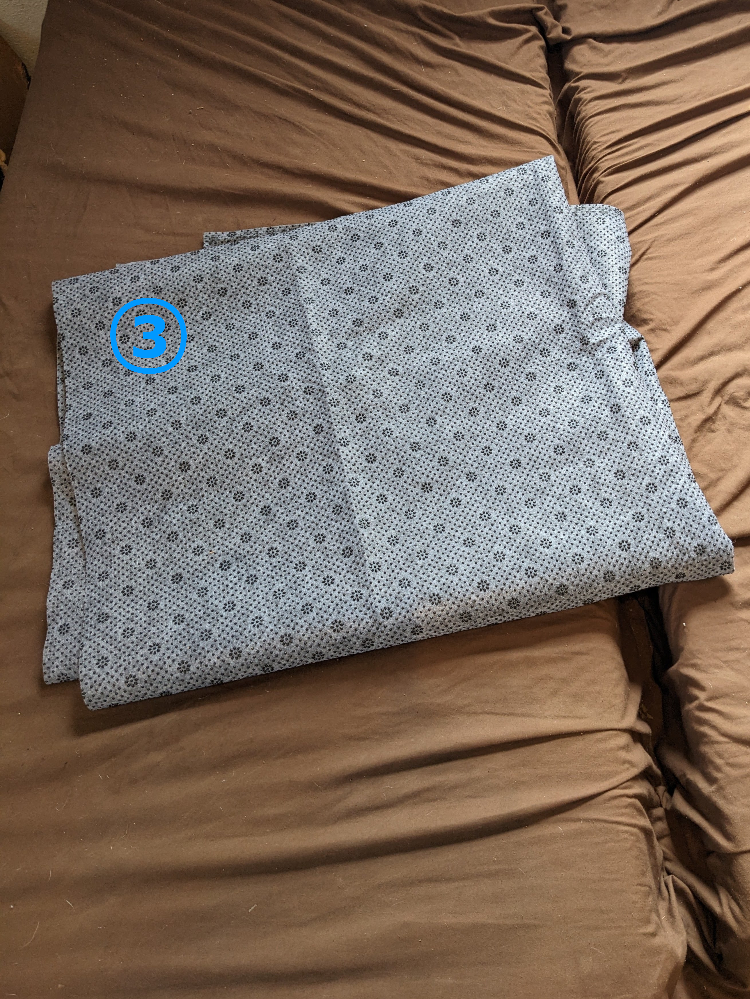

# Animal Donut Dog Bed Tutorial

Or, if that sequence of nouns is too hard to parse: A tutorial for making a bed for dogs which is both donut-shaped and also resembles an animal.

This bed has two zippers so you can take out the three internal cushions and wash the outer shell!

## Materials

  

    
  &#9312; About 3 yards of **lining fabric** - This fabric will be used inside the bed for the three removable cushions that contain all the stuffing.
  
  

  I use whatever inexpensive stretchy fabric I can find.
  
  I think using stretchy fabric here helps achieve the "overstuffed" look for the bed. When the lining fabric stretches, the stuffing is then less constricted by it, and still has a chance to push directly against the outside of the bed.

  I like it when the fabric has a woven-in or knitted-in striped or rectangular pattern, like the fabric I used in this case. It's a super helpful shortcut for measuring and cutting the right shape, since I can just cut along the stripe! Especially when I'm trying to cut out really big rectangular pieces in super stretchy fabric which is really hard to measure consistently as it stretches!
  

  
  **Purchasing tips and ideas**
      

    
  My newest favorite place for finding random cheap fabrics is Walmart's "Value Fabrics" aisle. It's basically an assortment of random fabric remnants at different length and price tiers. Depending on the fabrics, you get cuts of 2 yards for $4, 4 yards for $6, and 3 yards for $8. 

  The lining fabric I used for this bed was 4 yards for $6!

  You can order these online, but of course you'll just get a random selection which may or may not be worthwhile. So I prefer to actually go into a Walmart and see what I can find!

  I've also ordered "poly interlock lining fabric" online from both Walmart and Amazon at around $7-$8 for 3 yards. It works well, but it's only stretchy in one direction (also known as 2-way stretch, because of course jargon is more fun when it's counter-intuitive). So you have to be strategic about which direction you cut it in, especially for the donut part (you want it to stretch widthwise, not lengthwise).
  
  

  

  

    
  &#9313; About 3 yards of **fabric for the main bed surface**

  

  I used a slightly-stretchy fabric for this particular dog bed, it's almost like a french terry but with two colors of yarn on the terry side (black and white). 
  
  After that experience, **I highly recommend using a non-stretchy fabric** for this part of the bed. Attaching the long separating zipper was a small nightmare, because the fabric really wanted to stretch out and get all wonky while I was sewing. I ended up applying liberal amounts of basting glue (in addition to the usual pins and fabric clips) before sewing.

  For other similar beds, I've used minky and/or fleece fabric. Actually, a lot of stuffed dog toys "minky swirl fabric" and I found that dogs really like that fabric on a dog bed, too.

  

    
  &#9314; About 1 yard of **non-slip fabric for bottom of the bed**
  
  

  You can probably also just use the same fabric as you're using for the main bed surface, if you don't need it to be super non-slip and you're not worried about it getting super dirty from the floor.
  
  You really only need a piece a little bigger than 36" by 24", so if you buy a yard (which is 36") you may have a lot left over, depending on the width of the fabric.

  I was going to use the orange textured fabric for this at first. But then I bough the gray non-woven fabric in the second picture, it's actually meant to go under a rug to keep it from slipping around. (TODO: find out how it stands up to being in a washing machine.)
  

  

  &#9315; One really long **separating zipper** (around 100-110 inches long)
    
  

 This zipper will go around the bottom of the donut part. It has to be a separating zipper so it can unzip all the way and release the donut cushion.
  

  

  &#9316; One **shorter zipper** - at least 24 inches long, and it doesn't have to be a separating zipper.
    
  

 This zipper will open up a separate compartment for the bottom cushion.
  

  

  &#9317; At least 5 lbs of **fiber fill** (stuffing)
    
  

You can probably fit a lot more than 5 lbs of stuffing into these cushions, but 5 should be mostly enough. I think I used a little more for this particular bed.
  

  

  &#9318; (Optional?) A 36x24 piece of **high-density cushion foam**, 1 inch thick
    
  

This goes on the bottom of the bottom cushion, and then I put some of the fiber fill on top.

I'm not sure how much of a difference the foam really makes, but I've seen how flat and condensed the fiber fill in a donut bed can get without any foam under it, so I decided to be fancy and have both foam and fiber fill.
  

  

  &#9319; (Highly optional) **A "helpful" puppy** who really wants to be involved (and other occasional dog friends)
    
  

One could argue that the puppy is not a *material*, per se. But he really really tried hard to integrate himself into the bed throughout the process.

One could also argue that a dog or puppy is not strictly optional, if you're making a dog bed. What's optional is how involved the dog is in the making process.
  

  

  &#9320; (Not pictured) Additional odds and ends for the animal face - this really depends on what animal you are making and how you want to make it! 
  
  

For this bed, I ended up using some white fabric for the face and feet, scraps of black fabric for the eyes, and scraps of red fabric for the mouth.

I also used something that I'm pretty sure is called "3D mesh spacer fabric" inside the ear edges to keep the ears from being too floppy.
  

